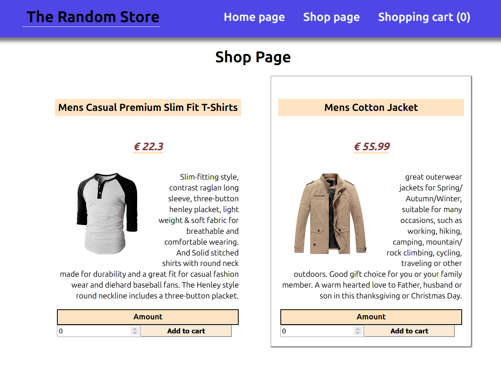

# A Shopping Cart

This project uses React to build a shopping cart. The items in the shop are retrieved via the [FakeStore API](https://fakestoreapi.com/). The project is tested with the React Testing Library.

## The Odin Project: Lesson Shopping Cart

This project is build according to the specification of the [Shopping Cart lesson](https://www.theodinproject.com/lessons/node-path-react-new-shopping-cart)

## Live website

Access the <a href='https://main--odin-react-shoppingcart.netlify.app/'>Shopping Cart</a>

## Redux version

Check out the [redux branch](https://github.com/Gohan61/shopping-cart/tree/redux) which uses Redux Toolkit to manage state and Tailwind CSS for styling. You can also access a demonstration video of the 

## Run locally

*In order to run project locally NodeJS + Git needs to installed on your system*

Follow these steps on Mac/Linux/WSL to run the project locally:

1. Open a terminal and go to a directory you want the repository to be in
2. Select Code in the Github project page and copy the SSH URL
3. git clone *SSH URL*
4. 'cd' into the repository you just cloned
5. Run 'npm install'
6. Run 'npm run dev'
7. Open the link that is shown in the terminal in your browser
